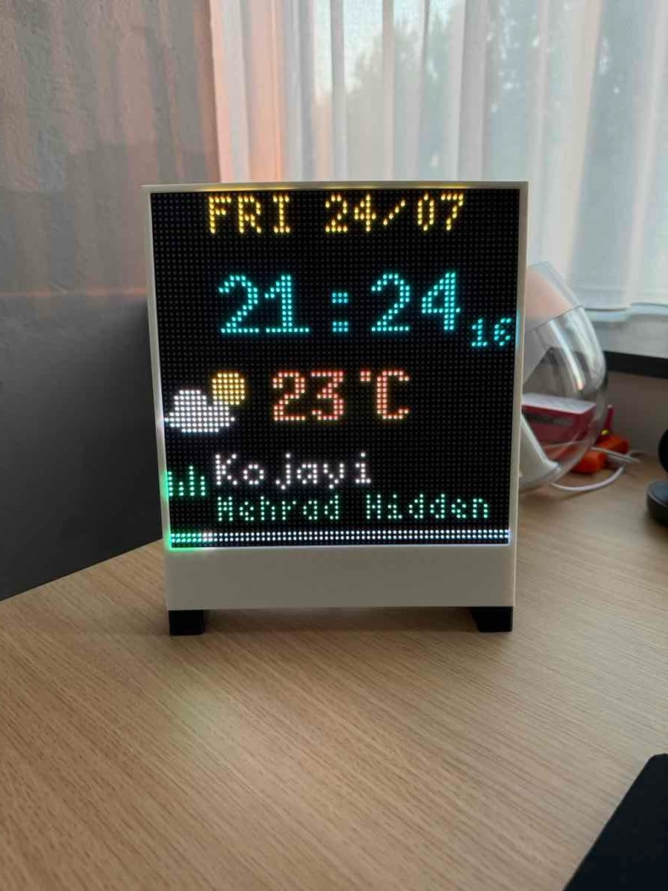

# LED Matrix Widget OS

A bare-metal Rust firmware that runs **WebAssembly widgets** on a 64×64 HUB75 LED matrix driven by an ESP32-S3. Widgets are written in TypeScript, compiled to WASM at build time, and executed on-device with full access to drawing, timers, HTTP, and Wi-Fi — without a reflash.



---

## Why WASM?

Most embedded displays are static — the rendering logic is baked into the firmware. If you want a new widget, you rebuild and reflash.

With WASM, each widget is an isolated module with its own memory and a well-defined host API. You can:

- **Add or swap widgets without reflashing** — drop a new `.wasm` file and restart.
- **Write widgets in any language that compiles to WASM** — this project uses AssemblyScript (TypeScript-like), but anything targeting WASM works.
- **Sandbox widget code** — a misbehaving widget cannot corrupt the display driver or crash the OS; the WASM executor catches it and moves on.
- **Iterate fast** — the widget build pipeline is just `npx asc` (AssemblyScript compiler), no Rust toolchain required.

---

## Architecture

```
┌──────────────────────────────────────────────────────────┐
│  config.json  ──▶  build script  ──▶  compiled firmware  │
│  widgets/*.ts ──▶  asc (WASM)    ──┘                     │
└──────────────────────────────────────────────────────────┘

         Core 0 (Embassy async)
┌─────────────────────────────────────────────────────────┐
│  WidgetManager                                          │
│  ┌───────────┐  ┌───────────┐  ┌──────────────────────┐ │
│  │  Widget A │  │  Widget B │  │      Widget C        │ │
│  │  WasmExec │  │  WasmExec │  │      WasmExec        │ │
│  └─────┬─────┘  └─────┬─────┘  └──────────┬───────────┘ │
│        └──────────────┴──────────────────┐│             │
│                   host bindings          ││             │
│  ┌──────────┐ ┌──────┐ ┌──────┐ ┌──────┐ ││             │
│  │  Drawer  │ │ Time │ │ HTTP │ │ Net  │ ││             │
│  └────┬─────┘ └──────┘ └──────┘ └──────┘ ││             │
└───────┼────────────────────────────────── ┘│            │
        │ flush()                            │            │
        ▼                                    │            │
   Framebuffer                       Events (timer /      │
        │                            HTTP response)       │
        ▼         Core 1 (bare loop)                      │
   HUB75 DMA ──▶  LED Matrix                              │
```

### Key components

**Drawer** (`src/drawer/`) — A trait with fluent builders for every primitive: `rect`, `circle`, `ellipse`, `triangle`, `arc`, `sector`, `line`, `text`, `clear`. Each widget receives a scoped `Viewport` that transparently translates coordinates relative to its placement rectangle, so widgets never need to know their position on the display.

**Widget & Executor** (`src/widget/`) — A `Widget` pairs a placement `Rect` with an `Executor`. The only executor today is `WasmExecutor`, which loads a WASM binary via [wasmi](https://github.com/wasmi-labs/wasmi) and calls its exported `render()` function each frame, passing in any pending events.

**WidgetManager** (`src/widget/manager.rs`) — Owns all active widgets. On each tick it calls `poll_events()` to collect expired timers and completed HTTP responses, routes them to the right widget, then calls `render()` on every widget and flushes the framebuffer.

**Events** (`src/widget/mod.rs`) — Two event types cross the host/WASM boundary: `TimerInterrupt { timer_id }` and `HttpResponse { request_id, headers, body, success }`. Widgets poll for events inside their `render()` function using the generated `pollEvent()` helper.

**HTTP service** (`src/http/`) — Async non-blocking HTTP(S) client. Widgets fire a request and get a `request_id` back immediately; the response arrives as an `HttpResponse` event on the next eligible frame.

**Time service** (`src/time/`) — Provides `getUnixTimestamp()` (NTP-synced via SNTP at boot) and `setTimeout()` / recurring timers scoped per widget.

**Codegen** (`build/`) — The build script scans `src/` for service traits annotated with `@wasm`, then auto-generates both the Rust wasmi host bindings (included via `include!` in `wasm.rs`) and the matching TypeScript declaration files in `widgets/lib/`. It then compiles every `widgets/*.ts` file with AssemblyScript and embeds the resulting WASM blobs in the firmware via `include_bytes!`. **No handwritten glue code needed** — adding a method to a service trait propagates to both sides automatically.

**Backend / Display** (`src/backend/`) — `LCDCAM64x64` wraps the [esp-hub75](https://github.com/liebman/esp-hub75) driver. Flushing the framebuffer runs on Core 1 in a tight bare-metal loop so DMA timing is never perturbed by async work on Core 0.

---

## Features & Roadmap

**Shipped**
- WASM widget runtime (wasmi, `no_std`, sandboxed per widget)
- AssemblyScript widget SDK with fluent drawing API
- Automatic host-binding codegen from annotated Rust traits
- NTP time sync (SNTP)
- Async HTTP/HTTPS client with per-widget request routing
- Wi-Fi connectivity with reconnect logic
- Per-widget viewports (coordinate translation + clipping)
- JSON build-time config (pins, Wi-Fi, widget placement)
- Dual-core: async OS on Core 0, DMA flush on Core 1
- Three built-in widgets: clock, weather, network status

**Planned**
- [ ] OTA widget updates (fetch + hot-swap WASM at runtime)
- [ ] Multi-page / carousel mode
- [ ] Brightness / gamma control
- [ ] Widget-to-widget messaging
- [ ] 128×64 and other matrix sizes

---

## Hardware

You need:

- **ESP32-S3** dev board (any variant with enough flash; 8 MB recommended)
- **64×64 HUB75 LED matrix panel** (standard 2121 or 3535 LEDs, 1/32 scan)
- **5 V power supply** — the matrix alone can draw 4–10 A at full brightness; do not power it from the ESP's USB port
- Jumper wires or a custom PCB

### Wiring

The default pin mapping (overridable in `config.json`):

| Signal | ESP32-S3 GPIO |
|--------|--------------|
| R1     | 5            |
| G1     | 6            |
| B1     | 7            |
| R2     | 15           |
| G2     | 16           |
| B2     | 17           |
| A      | 8            |
| B      | 3            |
| C      | 46           |
| D      | 9            |
| E      | 18           |
| CLK    | 10           |
| LAT    | 11           |
| OE/BLK | 12           |

Connect the matrix GND to the power supply GND and to the ESP GND. Connect the matrix VCC to the 5 V supply (not the ESP's 3.3 V rail).

---

## Configuration

Copy `config.example.json` to `config.json` and edit it before building. The file is parsed at compile time and baked into the firmware — no SD card or filesystem required.

```json
{
  "wifi": {
    "ssid": "your-network",
    "password": "your-password"
  },
  "display": {
    "freq_mhz": 20,
    "pins": {
      "red1": 5,  "grn1": 6,  "blu1": 7,
      "red2": 15, "grn2": 16, "blu2": 17,
      "addr0": 8, "addr1": 3, "addr2": 46, "addr3": 9, "addr4": 18,
      "blank": 12, "clock": 10, "latch": 11
    }
  },
  "widgets": [
    {
      "id": 1,
      "type": "time",
      "x": 0, "y": 0, "width": 64, "height": 30,
      "config": {
        "utc_offset":      "3600",
        "utc_dst_offset":  "7200",
        "dst_start_month": "3",
        "dst_end_month":   "10"
      }
    },
    {
      "id": 2,
      "type": "weather",
      "x": 0, "y": 28, "width": 64, "height": 23,
      "config": {
        "lat": "52.374",
        "lon": "4.899"
      }
    },
    {
      "id": 3,
      "type": "network",
      "x": 0, "y": 51, "width": 64, "height": 13,
      "config": {}
    }
  ]
}
```

`widgets` is a list of placement + config objects. `type` matches the filename in `widgets/` (without `.ts`). `x`/`y`/`width`/`height` define the widget's viewport on the 64×64 panel. The `config` object is passed as key-value strings to the widget at runtime via the `Config` API.

---

## Building & Flashing

### Prerequisites

```bash
# Rust ESP toolchain
rustup toolchain install esp
cargo install espflash

# AssemblyScript compiler (for widgets)
cd widgets && npm install
```

### Build

```bash
cargo build --release
```

The build script compiles all `widgets/*.ts` files to WASM and embeds them in the binary automatically.

### Flash

```bash
espflash flash --monitor target/xtensa-esp32s3-none-elf/release/widgets
```

---

## Built-in Widgets

### `time` — Clock & date

Displays the current date (`WED 22/07`), a large HH:MM clock with a blinking colon, and a small seconds counter. Timezone is configurable via `utc_offset` / `utc_dst_offset` and DST month boundaries.

Config keys: `utc_offset`, `utc_dst_offset`, `dst_start_month`, `dst_end_month` (all in seconds/month numbers as strings).

### `weather` — Current conditions

Fetches current weather from [Open-Meteo](https://open-meteo.com/) every 10 minutes. Shows an animated icon (sun, moon, cloud, rain, snow, fog, storm), temperature in °C, and a condition label. The icon animates independently via a 200 ms timer.

Config keys: `lat`, `lon` (decimal degrees as strings).

### `network` — Connectivity status

Shows a spinning animated globe, the device's internal IP address, and the public IP (fetched from `api.ipify.org`). The globe desaturates and a red slash appears when offline.

No config keys required.

---

## Writing a Custom Widget

A widget is a single TypeScript file in `widgets/` that exports a `render()` function. Drop it there and add an entry to `config.json` — the build system handles the rest.

### Minimal example

```typescript
// widgets/hello.ts
import { Drawer } from "./lib/drawer";
import { Point, Font } from "./lib/types";
import { Palette } from "./lib/palette";

const drawer = new Drawer();

export function render(): void {
  drawer.clear().execute();
  drawer.text("Hello!", new Point(32, 16))
    .color(Palette.CYAN)
    .font(Font.Font6x10)
    .execute();
}
```

### Available APIs

All APIs are in `widgets/lib/` and generated automatically from the Rust service traits.

**`Drawer`** — Drawing primitives. Every call returns a builder; chain options and call `.execute()`.

| Method | Description |
|--------|-------------|
| `rect(rect)` | Filled or stroked rectangle, with optional corner radius |
| `circle(center, radius)` | Filled or stroked circle |
| `ellipse(boundingBox)` | Filled or stroked ellipse |
| `triangle(p1, p2, p3)` | Filled or stroked triangle |
| `arc(center, radius)` | Arc (stroke only) with `angle_start` / `angle_sweep` in degrees |
| `sector(center, radius)` | Pie-slice sector |
| `line(start, end)` | Line with configurable `thickness` |
| `text(str, position)` | Text with `font`, `color`, `alignment`, `baseline`, optional background |
| `clear()` | Fill the widget's viewport with a solid color |
| `boundsWidth()` / `boundsHeight()` | Query the widget's allocated size |

**`Time`**

| Method | Description |
|--------|-------------|
| `getUnixTimestamp()` | Returns the NTP-synced UTC timestamp in seconds |
| `setTimeout(duration)` | One-shot or recurring timer; returns a `timer_id` |

**`Http`**

| Method | Description |
|--------|-------------|
| `fetch(method, url, body, headers)` | Fire an async HTTP(S) request; returns a `request_id`. The response arrives as an `HttpResponse` event. |

**`Network`**

| Method | Description |
|--------|-------------|
| `isConnected()` | `true` if Wi-Fi is up |
| `getIpAddress()` | Internal IPv4 as a packed `u32` |

**`Console`**

| Method | Description |
|--------|-------------|
| `info(msg)` / `warn(msg)` / `error(msg)` | Log to the serial console |

**`Config`**

| Method | Description |
|--------|-------------|
| `get(key)` | Returns the config value or `null` |
| `getOr(key, default)` | Returns the config value or a fallback |

### Handling events

Events are polled inside `render()` using the `pollEvent()` function from `lib/events`:

```typescript
import { pollEvent, EVENT_TIMER_INTERRUPT, TimerInterruptEvent,
         EVENT_HTTP_RESPONSE, HttpResponseEvent } from "./lib/events";

export function render(): void {
  let ev = pollEvent();
  while (ev !== null) {
    if (ev.type == EVENT_TIMER_INTERRUPT) {
      const t = ev as TimerInterruptEvent;
      // t.timerId matches the id returned by time.setTimeout(...)
    }
    if (ev.type == EVENT_HTTP_RESPONSE) {
      const r = ev as HttpResponseEvent;
      // r.requestId, r.body, r.success
    }
    ev = pollEvent();
  }
  // ... draw
}
```

### Fonts

Available via the `Font` enum in `lib/types.ts`. Ranges from `Font4x6` (tiny) to `Font10x20` (large), plus several `U8g2Font*` variants including a 3×3 minimum. Bold and italic variants exist for common sizes.

---

## License

MIT
